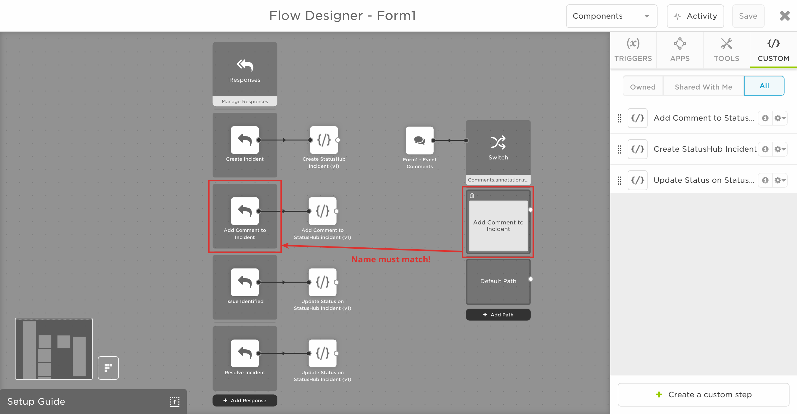
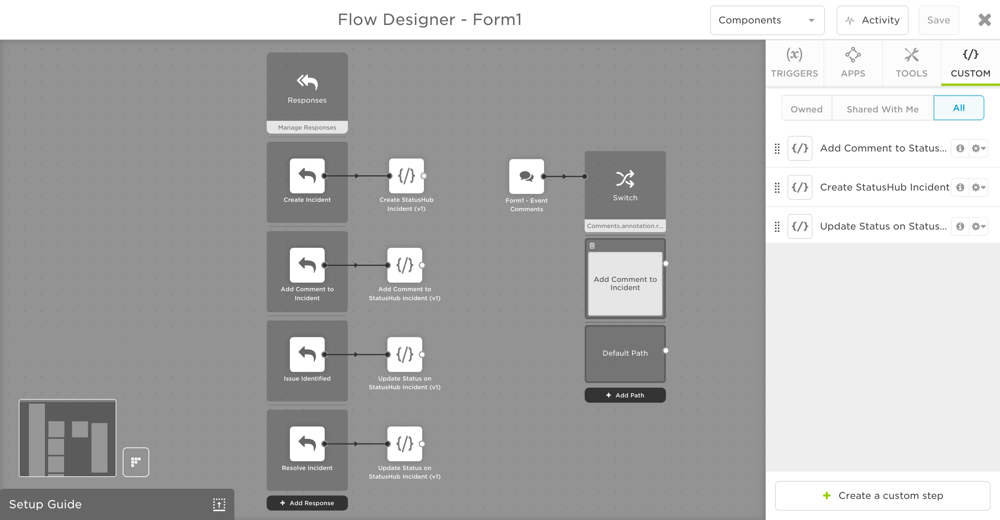

# StatusHub Outbound (from xMatters) Integration
This is part of the xMatters Labs awesome listing. For others, see [here](https://github.com/xmatters/xMatters-Labs).

With this Outbound Integration, notification recipients can quickly create, update, and resolve StatusHub incidents, right from the xMatters notification! 

This document details how to install and use this integration. 

---------

<kbd>

</kbd>

---------

# Pre-Requisites
* [StatusHub.io](https://www.StatusHub.io/) account
* Existing communication plan - Use a packaged integration from the [integrations](https://www.xmatters.com/integrations) page, or [build your own](https://support.xmatters.com/hc/en-us/articles/202396229) 
* xMatters account - If you don't have one, [get one](https://www.xmatters.com)! 

# Files

* [ExampleCommPlan](ExampleCommPlan.zip) - This is an example Communication Plan which you can import into xMatters to quickly import the custom steps
* [CreateIncidentScript](CreateIncidentScript.js) - This is the script that will be in the `Create Incident` step
* [UpdateIncidentScript](UpdateIncidentScript.js) - This is the script that will be in the `Update Incident Status` step
* [CommentIncidentScript](CommentIncidentScript.js) - This is the script that will be in the `Add Comment to Incident` step

# Installation

## Get StatusHub Token

1. Log in to your StatusHub.io account as an admin user
2. Click `Settings` in the top right corner, and then select `API Key` from left toolbar
3. On the API tab, click `Generate new API Key`, then copy the generated API Key

## Adding custom steps to Flow Designer

1. Log in to your xMatters instance, navigate to the Workflows tab, and for the Communication Plan you would like to add StatusHub options to
2. Create new form and then switch to **Flows** tab and click on **Create a flow**

3. Click and drag **Responses** into the flow

4. Under the Responses, click on **+ Add Response**

5. Add three new response options, filling in the following values, then click **Save**:

| Response | Email Description | Voice Prompt | Options |
| ---- | --- | --- | --- |
| Create Incident | Create Incident in StatusHub | Create Incident | Record Response |
| Add Comment to Incident | Add Comment to StatusHub Incident | Add Comment | Record Response |
| Issue Identified | Change Status of StatusHub Incident to `Identified` | Issue Identified | Record Response |
| Resolve Incident | Resolve Incident in StatusHub | Resolve Incident | Record Response |

* Note: For the `Add Comment to Incident` response option, make sure to check the `Enable comments` checkbox under the options dropdown

### `Create Incident` custom step

1. Inside the flow designer, click on the **Custom** tab, then click **Create a custom step**

2. Fill out the **Settings** with the following values

| Item | Value |
| --- | --- |
| Name | Create StatusHub Incident |
| Description | Create Incident in StatusHub |
| Include Endpoint | ✓ |
| Endpoint Type | No Authentication |
| Endpoint Label | StatusHub |

3. Add the following inputs to the **Inputs** tab

| Name | Required field | Help Text |
| --- | --- | --- |
| Subdomain | ✓ | e.g. [subdomain].statushub.io |
| API Key | ✓ | Found at https://app.statushub.io/my/account/token |
| Service Name | ✓ | Service name to create incidents under |
| Incident ID | ✓ | Unique identifier for incidents, use xMatters event.enentId |

* Note, the service name will be one of the services inside StatusHub, for example

In this example, you could use `Website`, `API`, or `HR Server` as possible service names
4. In the **Script** tab, copy the [CreateIncidentScript](./CreateIncidentScript.js)
5. Click **Save**, exit the custom step, then drag it into the flow, connecting it to the `Create Incident` response option
6. Double click the custom step you just dragged into the flow to edit it, then fill in the inputs with their respective values
7. In the `Endpoint` tab, click `+ Create New Endpoint`
8. Name the endpoint `StatusHub`, and set the Base URL to `https://api.statushub.io` (leave authentication type as None), then click **Save Changes** and close the tab

### `Update Incident Status` custom step
1. Inside the flow designer, click on the **Custom** tab, then click **Create a custom step**
2. Fill out the **Settings** with the following values

| Item | Value |
| --- | --- |
| Name | Update Status on StatusHub Incident |
| Description | Update Incident Status to `investigating`, `identified`, `monitoring`, or `resolved` |
| Include Endpoint | ✓ |
| Endpoint Type | No Authentication |
| Endpoint Label | StatusHub |

3. Add the following inputs to the **Inputs** tab

| Name | Required field | Help Text |
| --- | --- | --- |
| Subdomain | ✓ | e.g. [subdomain].statushub.io |
| API Key | ✓ | Found at https://app.statushub.io/my/account/token |
| Service Name | ✓ | Service name to create incidents under |
| Incident ID | ✓ | Unique identifier for incidents, use xMatters event.enentId |
| Status | ✓ | One of `investigating`, `identified`, `monitoring`, or `resolved` to change the Status to |

4. In the **Script** tab, copy the [UpdateIncidentScript](./UpdateIncidentScript.js)
5. Click **Save**, exit the custom step, then drag it into the flow, connecting it to the `Issue Identified` response option
6. Double click the custom step you just dragged into the flow to edit it, then fill in the inputs with their respective values
7. In the `Endpoint` tab, select `StatusHub` as the endpoint, then click **Save Changes** and exit
8. Drag another `Update Incident` step into the flow, connecting it to the `Resolve Incident` response option
9. Double click the custom step you just dragged into the flow to edit it, then fill in the inputs with their respective values
10. In the `Endpoint` tab, select `StatusHub` as the endpoint, then click **Save Changes** and exit

### `Add Comment to Incident` custom step
1. Inside the flow designer, click on the **Custom** tab, then click **Create a custom step**
2. Fill out the **Settings** with the following values

| Item | Value |
| --- | --- |
| Name | Add Comment to StatusHub incident |
| Description | Add a comment to StatusHub incident |
| Include Endpoint | ✓ |
| Endpoint Type | No Authentication |
| Endpoint Label | StatusHub |

3. Add the following inputs to the **Inputs** tab

| Name | Required field | Help Text |
| --- | --- | --- |
| Subdomain | ✓ | e.g. [subdomain].statushub.io |
| API Key | ✓ | Found at https://app.statushub.io/my/account/token |
| Service Name | ✓ | Service name to create incidents under |
| Incident ID | ✓ | Unique identifier for incidents, use xMatters event.enentId |
| Comment | ✓ | Fill in with `annotation.comment` following an `Event Comments` trigger |

4. In the **Script** tab, copy the [CommentIncidentScript](./CommentIncidentScript.js)
5. Click **Save**, exit the custom step, then drag it into the flow
6. Next, inside the flow, click on the `Triggers` tab, then drag in the **Event Comments** trigger into the flow
7. Click on the `Tools` tab, then drag in the **Switch** trigger into the flow, connecting it to the event comments trigger
8. Double click on the `Switch` trigger inside the flow, and set the property to `Comments.annotation.response.response`, then click **Done**
9. Click on `Add Path`, click on the created trigger, and set the value to match the comment response option.

10. Drag the comment custom step you just created into the flow, and connect it to the `Add Comment to Incident` response option
11. Double click the custom step you just dragged into the flow to edit it, then fill in the inputs with their respective values
12. In the `Endpoint` tab, select `StatusHub` as the endpoint, then click **Save Changes** and exit

Now that we have all the steps, your flow should look something like this:

# Testing

Testing the changes will differ based on your specific communication plan, but new events will have four new response options. For example:

1. After responding with `Create Incident`, you should see an incident in your StatusHub instance 
2. Using `Add Comment to Incident` and entering a comment in xMatters, you should be able to add a comment to the incident.
3. Using `Issue Identified`, (note, you could also have a response option for each of changing the incident to `investigating`, `identified`, `monitoring`, and `resolved` if you so choose) you should be able to change the status of the incident to `identified`
4. Using `Resolve Incident`, you should be able to resolve the incident

If any of these do not work, go back to the installation section and make sure you copied the correct script, defined all your inputs correctly, and set the correct endpoint

# Troubleshooting

If you are running in to issues, go to the flow, and click on **Activity**

Click on the response option you are having issues with, then click **Log**

The log should be able to give you some guidance on what is going wrong, in this case the StatusHub endpoint was created but I forgot to set the endpoint in the custom step :)

That's it! If you have any more questions, reach out to an xPert.
